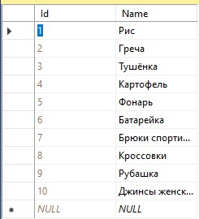
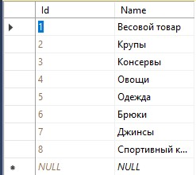
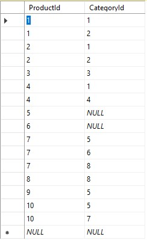
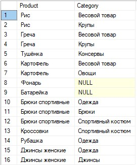

# InterviewTask_SQL

В данном репозитории содержится SQL файл "ProductsAndCategories.sql", код которого является решением поставленной задачи:

<b>В базе данных MS SQL Server есть продукты и категории. Одному продукту может соответствовать много категорий, в одной категории может быть много продуктов. Напишите SQL запрос для выбора всех пар «Имя продукта – Имя категории». Если у продукта нет категорий, то его имя все равно должно выводиться.</b>

Исходные таблицы данных:

Продукты:

Категории:

Продукты и категории (id):

Ниже показан результат выполнения SQL запроса:

